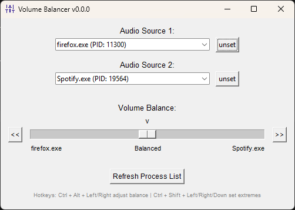

# Volume Balancer

A simple Windows app to balance the volume of two processes.



## Requirements

- Python 3.12+
- Pipenv
- Windows OS

## Installation

1. Install the required dependencies:
```bash
pipenv sync
```

## Usage

Run the application from project root:
```bash
pipenv run python -m src.main
```

1. Select audio processes from the dropdowns
2. Use the balance slider to adjust the volume:
   - Left side (-1.0): Process 1 at full volume, Process 2 muted
   - Center (0.0): Both processes at full volume
   - Right side (1.0): Process 2 at full volume, Process 1 muted

## Notes

- Only processes with active audio sessions (recent audio output) will appear in the dropdowns

